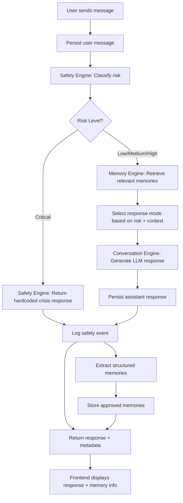
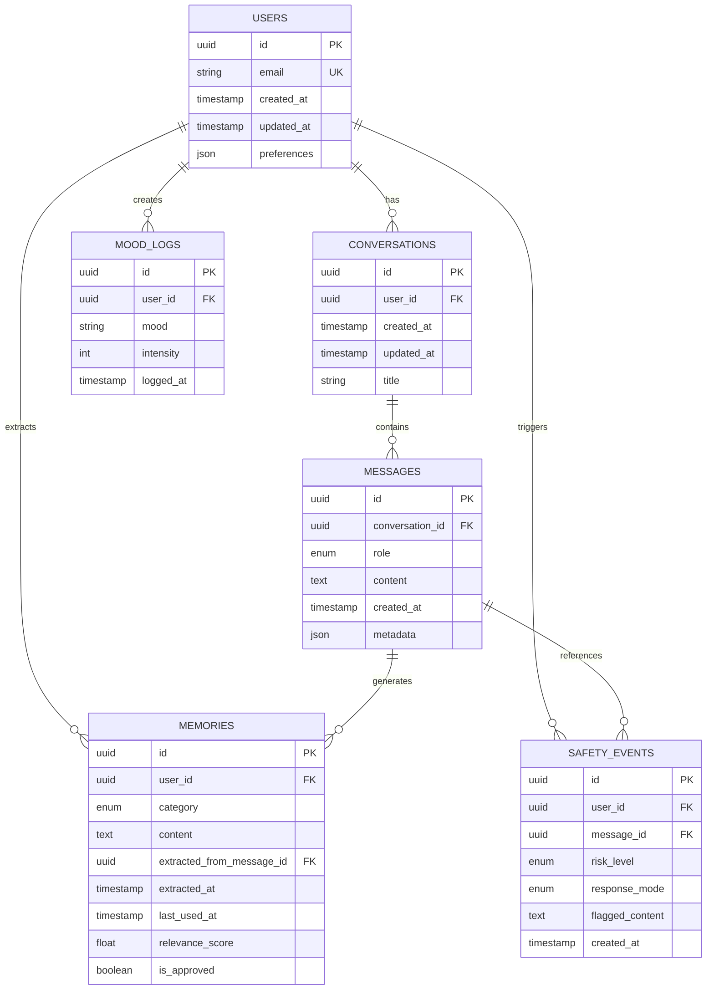

# Architecture: Memory-Aware Support Companion

## Overview

**Memory-Aware Support Companion** is a mobile-first AI support application that provides conversational support with structured memory and safety-aware routing. It is **not** a therapist, diagnostic tool, or treatment platform.

### What It Is
- A **mobile app** (React Native/Expo) where users chat with an AI
- **Memory-aware**: Extracts and retrieves structured user context across sessions
- **Safety-routed**: Detects risky messages and switches to appropriate response modes
- **Transparent**: Shows users which memories influenced each response
- **Modular backend**: Service-oriented FastAPI architecture with clear separation of concerns

### What It Is NOT
- A therapeutic system or clinical tool
- A diagnostic instrument
- A replacement for mental health treatment
- An autonomous agent system (it is a controlled decision pipeline)
- A system that generates emergency resources dynamically in critical moments

### Core MVP Goals
1. Build a demoable, production-leaning vertical slice
2. Emphasize **memory retrieval**, **safety classification**, and **transparent memory usage**
3. Create modular, testable architecture suitable for portfolio/interview discussion
4. Prioritize correctness and structure over feature breadth

---

## The 3 Brains Model

The backend is organized around three independent, collaborative services. This separation enables:
- **Testability**: Each service has clear inputs/outputs and can be tested in isolation
- **Safety**: The Safety Engine can enforce policy without being entangled with conversation logic
- **Flexibility**: Services can be upgraded or replaced independently

### 1. Conversation Engine

**Purpose**  
Generate contextually appropriate responses in different modes based on user input and detected risk level.

**Responsibilities**
- Accept user message, risk classification, and retrieved memories
- Select an appropriate response mode (vent, reflect, plan, grounding, crisis)
- Call LLM (or return hardcoded response for crisis mode)
- Return response text and metadata

**Inputs**
- User message text
- Risk classification (low, medium, high, critical)
- Retrieved relevant memories
- Recent conversation context
- User preferences

**Outputs**
- Response text
- Response mode used
- Metadata (e.g., which mode was selected and why)

**Why Separate**  
The Conversation Engine is isolated from safety classification and memory logic. It only generates responses based on inputs it receives. This means:
- Response generation can be tested without a safety classifier
- The same response logic can be reused with different safety policies
- Crisis responses (hardcoded, deterministic) live in the Safety Engine, not here

---

### 2. Memory Engine

**Purpose**  
Extract structured, stable context from conversations and retrieve relevant memories for new messages.

**Responsibilities**
- Analyze conversation text and extract structured memories (stressors, coping strategies, preferences)
- Store memories with metadata (extracted date, relevance, last used)
- Retrieve top-k memories relevant to a user query
- Provide memory audit trail (which memories were used in which response)

**Inputs**
- Conversation text (user + assistant messages)
- Search query (the current user message)
- User ID and session context

**Outputs**
- Extracted structured memory (if extracted from a conversation)
- Retrieved memories list (for a query)
- Retrieval audit info (memory IDs used, relevance scores)

**Why Separate**  
Memory extraction and retrieval are complex, testable systems independent of conversation generation. Separating them allows:
- Memory logic to be optimized (e.g., adding embeddings) without touching conversation code
- Transparent audit trail of which memories influenced which responses
- Future expansion to semantic search or user-controlled memory editing
- Clear data model for structured memories (not just transcript stuffing)

---

### 3. Safety Engine

**Purpose**  
Classify user input risk level and enforce deterministic, policy-driven response routing.

**Responsibilities**
- Classify risk level of user message (low, medium, high, critical)
- For critical-risk: immediately return hardcoded crisis response + resources
- For non-critical: allow normal conversation flow
- Log safety events for audit and monitoring
- Ensure crisis responses are **never** dynamically generated

**Inputs**
- User message text
- Conversation history (for context)

**Outputs**
- Risk classification enum (low, medium, high, critical)
- For critical-risk: deterministic crisis response + action flags
- Safety event log entry

**Why Separate**  
Safety classification is a critical responsibility that must be:
- Explicit and testable
- Independent of conversation generation logic
- Able to enforce deterministic bypass (critical-risk → hardcoded response)
- Auditable (every safety event logged)

Keeping it separate ensures that conversation logic cannot accidentally bypass safety policy, and safety policy can be updated or tested without touching conversation code.

---

## Request Pipeline

When a user sends a message, the backend executes the following flow:

### Step-by-Step Flow

1. **Receive Message**
   - User sends message via chat API
   - Message validated and normalized

2. **Persist User Message**
   - Message stored in database with timestamp and user ID
   - Creates conversation record if first message in session

3. **Classify Safety/Risk**
   - Safety Engine analyzes message for risk indicators
   - Returns risk level: low, medium, high, or critical

4. **Check for Critical Risk**
   - If **critical**: enter deterministic crisis-response path (does not proceed to later steps)
     - Log a structured safety event (including user ID, timestamp, and risk classification)
     - Route to a predefined, non-personalized crisis-response message set (no normal mode selection)
     - Avoid calling the general Conversation Engine or writing new long-term memories
     - Return crisis-response output to the client and terminate the pipeline
   - If **non-critical**: continue to step 5

5. **Retrieve Context**
   - Memory Engine retrieves top relevant memories for this user
   - Last N messages from conversation history loaded
   - Context packaged for response generation

6. **Select Response Mode**
   - Based on risk level and memory context, determine mode:
     - `vent` – empathetic acknowledgment without problem-solving
     - `reflect` – gentle reflection and reframing
     - `plan` – structured goal/action-oriented response
     - `grounding` – grounding/coping technique (for medium/high risk)
   - Mode selection logic lives in Conversation Engine or a routing service

7. **Generate Response**
   - Conversation Engine calls LLM with:
     - User message
     - Selected mode
     - Retrieved memories
     - Conversation context
   - LLM returns response text

8. **Persist Assistant Response**
   - Response stored in database
   - Associated with conversation, includes metadata (mode, risk level, memory IDs used)

9. **Log Safety Event** *(if applicable)*
   - If risk level ≥ medium, create safety event record
   - Stores risk classification, message content, response mode, timestamp
   - Useful for monitoring and audit

10. **Extract & Store Structured Memory** *(if applicable)*
    - If risk level ≤ medium and enough signal:
      - Memory Engine extracts structured memories from latest exchange
      - Memories categorized: stressors, coping_strategies, preferences
      - Stored with extraction confidence and user approval status
    - (Critical/high-risk messages may not undergo extraction due to sensitivity)

11. **Return Response to Client**
    - Response text + metadata sent to frontend
    - Metadata includes: mode, risk level, relevant memory IDs (for transparency)

---

### Pipeline Flowchart

**Key Design Decisions**
- **Deterministic critical-risk bypass**: No LLM call for critical risk. Returns hardcoded response with predefined resources.
- **Memory transparency**: Memory IDs and retrieval logic returned to client so UI can show "your memories influenced this response."
- **Service isolation**: Each service is called in sequence. Services don't call each other (thin orchestration layer handles coordination).
- **Audit trail**: Safety events logged for all non-low-risk messages. Memory extraction logged for visibility.

---

## Database Schema

### Core Tables

#### `users`
Stores user account information and privacy settings.
- `id` (UUID, PK)
- `email` (string, unique)
- `created_at` (timestamp)
- `updated_at` (timestamp)
- `preferences` (JSON) – e.g., response mode preferences, memory categories to extract

#### `conversations`
Top-level container for a chat session.
- `id` (UUID, PK)
- `user_id` (UUID, FK → users)
- `created_at` (timestamp)
- `updated_at` (timestamp)
- `title` (string, nullable) – user-given or auto-generated title

#### `messages`
Individual messages within a conversation.
- `id` (UUID, PK)
- `conversation_id` (UUID, FK → conversations)
- `role` (enum: user, assistant)
- `content` (text)
- `created_at` (timestamp)
- `metadata` (JSON) – response mode, risk level, retrieved memory IDs, etc.

#### `memories`
Structured, extracted user context (not full transcripts).
- `id` (UUID, PK)
- `user_id` (UUID, FK → users)
- `category` (enum: recurring_stressor, coping_strategy, preference)
- `content` (text) – the actual memory text
- `extracted_from_message_id` (UUID, FK → messages) – which message generated this memory
- `extracted_at` (timestamp)
- `last_used_at` (timestamp, nullable)
- `relevance_score` (float) – for future ranking/filtering
- `is_approved` (boolean) – user has reviewed/approved

#### `mood_logs`
Optional mood check-ins (future feature, sketched for schema completeness).
- `id` (UUID, PK)
- `user_id` (UUID, FK → users)
- `mood` (string/enum) – e.g., anxious, calm, energized
- `intensity` (int, 1-10)
- `logged_at` (timestamp)

#### `safety_events`
Audit trail of risk classifications and safety interventions.
- `id` (UUID, PK)
- `user_id` (UUID, FK → users)
- `message_id` (UUID, FK → messages)
- `risk_level` (enum: low, medium, high, critical)
- `response_mode` (enum: vent, reflect, plan, grounding, crisis)
- `flagged_content` (text) – potentially sensitive content (encrypted/masked in logs)
- `created_at` (timestamp)

---

### Entity-Relationship Diagram

---

## MVP Design Principles

### 1. Structured Memory, Not Transcript Stuffing
We extract and store *meaningful, stable context* (stressors, coping strategies, preferences) rather than feeding entire conversation histories to the LLM. This:
- Reduces token usage
- Improves memory signal-to-noise ratio
- Makes memory retrieval transparent and auditable
- Scales better as conversations grow long

### 2. Deterministic Critical-Risk Bypass
When critical risk is detected, the system **immediately** returns a hardcoded, deterministic crisis response. This response:
- Never involves LLM generation
- Always includes consistent emergency resources
- Cannot be influenced by user input or model behavior
- Is logged and auditable

This enforces the principle that critical moments require predictable, safe behavior, not creative generation.

### 3. Transparent Memory Retrieval
The frontend always shows users which memories influenced the current response. This:
- Builds trust ("I can see what the AI knows about me")
- Helps users identify outdated or incorrect memories
- Sets expectation that the system is not magic, but a structured tool
- Supports future memory editing features

### 4. Service-Oriented Backend
Three independent services (Conversation, Memory, Safety) each handle a single responsibility. This:
- Enables testing in isolation
- Allows services to be upgraded or replaced independently
- Makes safety policy explicit and independent of conversation logic
- Simplifies debugging and reasoning about behavior

### 5. Minimal But Demoable Vertical Slice
The MVP implements:
- User accounts and chat history
- Basic memory extraction (recurring stressors, coping strategies, preferences)
- Risk classification with mode switching
- Memory retrieval and transparency
- Deterministic crisis response

We **do not** build:
- Embeddings/semantic retrieval (hardcoded rules for now)
- Memory editing UI (approval checkbox only)
- Mood analytics or trends
- Background workers for async extraction

---

## Future Extensions

These are **not** part of the MVP but represent natural extensions of the architecture:

- **Semantic Memory Retrieval**: Add embedding-based similarity search to surface more nuanced, relevant memories
- **Memory Management UI**: Allow users to view, edit, or delete extracted memories
- **Mood Analytics**: Mood check-ins aggregated into trends and patterns; surfaced in reflection mode
- **Background Memory Extraction**: Asynchronous job to re-extract memories from old conversations as extraction logic improves
- **Multi-User Support**: Therapist/supporter accounts that can view (with consent) user conversation summaries
- **Export & Portability**: Allow users to export their memories and conversations in standard formats

---

## Implementation Notes

- **Frontend** is React Native + Expo (TypeScript) for mobile-first experience
- **Backend** is FastAPI (Python) with service-layer organization
- **Database** is PostgreSQL with structured schema (see above)
- **No external complexity**: We avoid Redis, background workers, vector DBs, or complex async patterns in the MVP
- **Testing focus**: Core logic (risk classification, mode selection, memory extraction) is unit-tested with clear inputs/outputs
- **Prompt management**: LLM prompts are stored in dedicated template files, not inline in routes
- **Auth & encryption**: Future work; MVP assumes simple session-based auth for MVP/demo purposes

---

## Diagram Legend

- `uuid` = Universally unique identifier (primary key)
- `FK` = Foreign key (relationship to another table)
- `UK` = Unique constraint
- `enum` = Enumerated type (fixed set of values)
- `json` = Flexible JSON field for extensibility
- `PK` = Primary key
